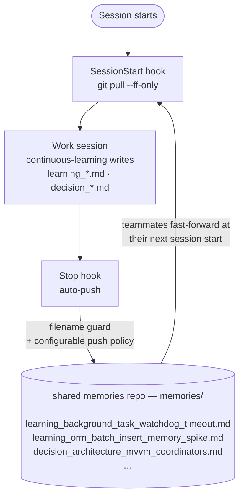
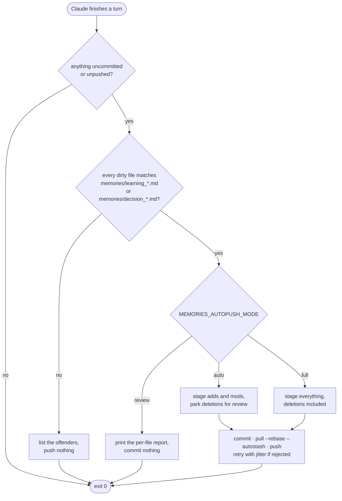
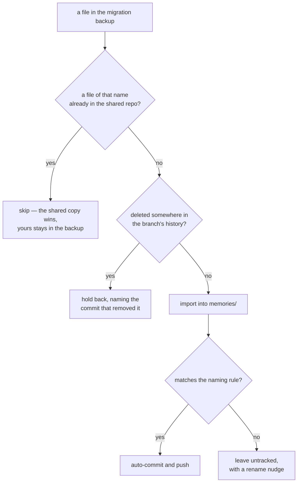

# 🧠 Shared Memories

A [tech pack](https://github.com/mcs-cli/mcs) that auto-syncs Claude Code's `.claude/memories/` across a team via a dedicated shared git repo. Captures are handled by [`mcs-cli/memory`](https://github.com/mcs-cli/memory) (the `continuous-learning` skill + semantic retrieval); this pack **shares** those captures across the team without anyone remembering to commit or push.

Built for the [`mcs`](https://github.com/mcs-cli/mcs) configuration engine.

```
identifier: shared-memories
requires:   mcs >= 2026.9.3
```

**Contents** — [When is this useful?](#-when-is-this-useful) · [The problem](#-the-problem) · [How it works](#-how-it-works) · [What's included](#-whats-included) · [Installation](#-installation) · [Directory structure](#-directory-structure) · [Migration](#-migration-from-an-existing-local-memories-folder) · [Side branches](#-optional-push-to-a-side-branch) · [Auto-push modes](#-auto-push-modes) · [Deletions](#-intentional-deletion-workflow) · [Troubleshooting](#-troubleshooting) · [Development](#-development)

---

## 🤔 When Is This Useful?

**You probably don't need this pack if** your team commits `.claude/memories/` directly into the project repo — normal git workflow already shares those memories across the team and this pack adds nothing.

**This pack is useful when**:

- You want memories in a **dedicated repo**, separate from project code — to avoid noising project PRs with memory-only diffs, to apply different access or review rules, or because the project's default-branch rulesets make small auto-commits painful.
- You run **multiple related repos** (microservices, mobile + web + backend, split client/server) that should share the **same memory corpus** — a learning about the auth contract is relevant to every service that talks to it, and a central memories repo lets all of them read/write the same KB.
- You want team memories to **outlive individual project repos** — short-lived prototypes, archived services, or repos that come and go shouldn't take institutional knowledge with them.

---

## 🧩 The Problem

Claude Code's `.claude/memories/` is great — you accumulate `learning_*.md` and `decision_*.md` files and Claude gets smarter about your codebase over time. But memories are **per-engineer**: when someone figures out a gnarly integration quirk or pins down a subtle architecture decision, only they benefit.

The obvious fix is a shared git repo. Two friction points kill adoption:

1. **Remembering to push.** People forget. Memories sit on laptops for weeks.
2. **Branch protection on the shared repo.** If every Claude turn needs a PR + ticket + approval, nobody will bother pushing their tiny observations.

## 🔁 The Solution

This pack implements a **closed-loop sharing system** that pulls the latest team memories at session start and pushes new ones when Claude finishes a turn.



Captures still come from [`mcs-cli/memory`](https://github.com/mcs-cli/memory). This pack is the distribution layer that makes them team-shared.

---

## 🔩 How It Works

### The Pieces

| Piece | What | How |
|-------|------|-----|
| **SessionStart Hook** | Pulls the latest team memories at session start | `git pull --ff-only` against the shared checkout; also flags lingering uncommitted/unpushed state — a stuck auto-push in `auto` / `full` mode, or pending changes awaiting decision in `review` mode |
| **Stop Hook** | Handles new/modified memory files after each Claude turn per `MEMORIES_AUTOPUSH_MODE` (`auto` / `full` / `review`) | Runs async; filename guardrail blocks bad names in every mode; mode dictates whether deletions auto-push, whether anything is committed at all, and (in `review`) prints the per-turn pending-changes report |
| **PostToolUse Hook** | Tells Claude in-conversation that a memory was saved in `review` mode, so it can mention pending review and invoke `/approve-memories` when the user confirms | Fires sync after `Write` / `Edit` / `MultiEdit` to `.claude/memories/`; injects `additionalContext` into Claude's next decision step. Silent in `auto` and `full` |
| **/approve-memories Slash Command** | One shared approval surface both the user and Claude invoke identically — stages, commits, pulls `--rebase`, pushes everything pending under `memories/` | Re-runs the Stop-hook filename guardrail; takes an optional commit-message reason; works in every mode (primary use is `review`; also unblocks state stuck after a push failure in `auto` / `full`) |
| **Sparse Checkout + Symlink** | Keeps the shared repo invisible on disk | `.claude/.memories-repo/` is a blobless single-branch sparse clone; `.claude/memories` is a symlink Claude Code reads from |
| **CLAUDE.local.md Section** | Tells Claude the memories folder is a shared checkout rather than local scratch, so it doesn't stage memories in the wrong repo, misread an empty `git log` as "no history", or tidy away a teammate's file | An mcs template section (`shared-memories.instructions`) composed into `CLAUDE.local.md` on every `mcs sync`, between `<!-- mcs:begin -->` markers; your own content outside the markers is preserved |

### The Feedback Loop

1. **First `mcs sync`** — the configure script clones the shared repo sparsely into `.claude/.memories-repo/`, symlinks `.claude/memories` to it, and migrates any pre-existing local memories into the shared folder (conflicts are preserved for manual review)

2. **Session starts** — the SessionStart hook fast-forwards the shared checkout and warns about any lingering state (auth failure / rebase conflict / guardrail-rejected files in `auto` / `full`; pending review items in `review`)

3. **During work** — Claude uses the [`continuous-learning`](https://github.com/mcs-cli/memory) skill to write new `learning_*.md` / `decision_*.md` files

4. **Claude finishes a turn** — the Stop hook collects dirty files and dispatches by mode (`MEMORIES_AUTOPUSH_MODE`, see [Auto-Push Modes](#-auto-push-modes)):
   - **Naming guardrail (all modes)** — any file failing `^memories/(learning|decision)_[a-zA-Z0-9_-]+\.md$` halts everything until renamed
   - **`auto` (default)** — adds/mods auto-pushed; deletions parked in the working tree for manual review
   - **`full`** — adds/mods AND deletions auto-pushed in one commit
   - **`review`** — nothing auto; the hook prints a per-file report and the user (or Claude, via the PostToolUse nudge) invokes `/approve-memories` to push, or runs the discard commands shown in the report

5. **Next session** — teammates pull your new memories via SessionStart and the loop continues

The Stop hook in full, since it is where all the policy lives:



---

## 📦 What's Included

### Session Hooks

| Hook | Event | What It Does |
|------|-------|-------------|
| **pull.mts** | `SessionStart` | Fast-forwards the shared memories checkout; emits a mode-aware warning if previous state is stuck (or, in `review` mode, summarises pending review) |
| **autopush.mts** | `Stop` (async) | Dispatches by `MEMORIES_AUTOPUSH_MODE` mode (`auto` / `full` / `review`); filename guardrail applies in every mode |
| **announce.mts** | `PostToolUse` (Write/Edit/MultiEdit) | In `review` mode only, surfaces the just-written memory to Claude's context so it mentions pending review in chat. Silent in `auto` and `full` |

Each runs as `node --experimental-strip-types --disable-warning=ExperimentalWarning <path>`: mcs prefixes the interpreter the hook declares in `hookInterpreter`, and never looks at the shebang. They install to `.claude/hooks/shared-memories/`, with the library they import beside them in `lib/`.

### Slash Commands

| Command | What It Does |
|---------|-------------|
| **/approve-memories** | Stages, commits, pulls `--rebase`, and pushes everything pending under `memories/`. Primary entry point for `review` mode approval; also unblocks state stuck after a push failure in `auto` / `full` |

### Configuration Script

| Script | When | What It Does |
|--------|------|-------------|
| **configure-memories.ts** | `mcs sync` | Sparse-clones the shared repo, sets up the symlink, migrates any pre-existing `.claude/memories/` into the shared folder |

### CLAUDE.local.md Section

| Section | What It Does |
|---------|-------------|
| **shared-memories.instructions** | Four facts Claude cannot infer from the filesystem: writes and deletions are proposals to the team's repo; the memory set changes between sessions; the parent project's git doesn't track memories (so `git add` there is a silent no-op); and memory files must be addressed as `git -C .claude/.memories-repo -- memories/<file>` |

### Doctor Checks

| Check | What It Verifies |
|-------|-----------------|
| **Shared memories setup** | Sparse checkout exists and the symlink resolves to a live git repo (auto-fixable via `mcs sync`) |
| **Shared memories remote access** | Auth + network reachability via `git ls-remote origin`; warns (doesn't fail) on issues since local reads still work |

### Dependencies

| Dep | Via |
|-----|-----|
| **Node.js 22.6+** | brew |

Node runs the TypeScript directly — there is no build step, no `node_modules`, and no runtime dependencies.

---

## 🚀 Installation

### Prerequisites

- macOS
- Node.js 22.6 or newer (where `--experimental-strip-types` landed)
- [Claude Code](https://docs.anthropic.com/en/docs/claude-code) CLI
- [mcs](https://github.com/mcs-cli/mcs) CLI
- [`mcs-cli/memory`](https://github.com/mcs-cli/memory) (companion capture pack — produces the `learning_*.md` / `decision_*.md` files this pack shares)
- A git repo the team can push to (SSH or HTTPS access)

### Setup

```bash
# 1. Install mcs
brew install mcs-cli/tap/mcs

# 2. Register both packs (capture + share)
mcs pack add mcs-cli/memory
mcs pack add mcs-cli/shared-memories

# 3. Sync your project
cd ~/Developer/my-project
mcs sync

# 4. Verify everything is healthy
mcs doctor
```

During `mcs sync`, you'll be prompted for:

| Prompt | What It Does | Default |
|--------|-------------|---------|
| **MEMORIES_REPO_URL** | Clone URL for the shared memories repo, e.g. `git@github.com:org/memories.git` | *(required)* |
| **MEMORIES_BRANCH** | Branch that holds the memory files and this pack | `main` |
| **MEMORIES_AUTOPUSH_MODE** | Stop-hook behavior — `auto` (writes auto-pushed, deletions parked), `full` (writes + deletions auto-pushed), or `review` (nothing auto, per-turn report). See [Auto-Push Modes](#-auto-push-modes). | `auto` |

> **Install per-project, not globally.** Run `mcs sync` from each project's root (the directory that contains `.claude/`, not `.claude/` itself) — do **not** install this pack into your user-level `~/.claude/` directory.
>
> The hooks anchor on their own on-disk location and operate on a sibling `.memories-repo/` working tree. A single global install would collapse every project onto one shared checkout, which breaks two things:
>
> 1. **Concurrent sessions race on the same working tree.** If you run Claude in two projects at the same time, both Stop hooks try to stage, commit, rebase, and push against the same `.git` index — you'll see interleaved commits, half-applied rebases, and dedupe state (`review` mode's `.review-shown`) stomped between sessions.
> 2. **Project context bleeds across sessions.** Memories Claude writes while working on project A would be auto-pushed under project B's session if B happens to end its turn first.
>
> Per-project installs keep one independent clone per repo while still sharing the same remote, so the team-wide KB stays unified without the local race conditions.

---

## 📁 Directory Structure

```
shared-memories/
├── techpack.yaml                    # Manifest — defines all components
├── commands/
│   └── approve-memories.md          # Slash command for review-mode approval
├── config/
│   └── settings.json                # Templated env block — ships MEMORIES_AUTOPUSH_MODE
├── runtime/                         # Installed to .claude/hooks/shared-memories/
│   ├── pull.mts                     # SessionStart: pull + stuck-state warning
│   ├── autopush.mts                 # Stop: auto-commit + push (async)
│   ├── announce.mts                 # PostToolUse: review-mode nudge to Claude (sync)
│   └── lib/                         # git, paths, naming, mode, pending, report, push
├── scripts/                         # Run in place from the pack checkout
│   ├── configure-memories.ts        # Sparse clone + symlink + migration
│   ├── doctor-memories.ts           # Setup health check
│   └── doctor-memories-remote.ts    # Remote-access health check
├── tests/                           # node:test — unit, contract and behaviour
│   └── golden/                      # Behaviour recordings the suite checks against
├── templates/
│   └── instructions.md              # CLAUDE.local.md section — what this dir is
├── .github/workflows/ci.yml         # macOS × Node 22.6/22/24
├── package.json                     # No dependencies; test + typecheck scripts
└── tsconfig.json                    # Strict, erasable-syntax-only, no emit
```

On engineer disks, the pack materializes as:

```
<project>/.claude/
├── hooks/shared-memories/           # run by mcs via each hook's declared hookInterpreter
│   ├── pull.mts
│   ├── autopush.mts
│   ├── announce.mts
│   └── lib/                         # imported as ./lib/… by the entries beside it
├── .memories-repo/                  # sparse clone of MEMORIES_BRANCH
│   ├── README.md, LICENSE, etc.     # any root-level files your repo ships
│   └── memories/
│       ├── learning_*.md
│       └── decision_*.md
└── memories -> .memories-repo/memories   # symlink Claude Code reads
```

The clone uses `--sparse --filter=blob:none --single-branch` so only the `memories/` subtree plus any root-level files your repo ships (README, LICENSE) materialize on disk (~1 MB typical). Every hook git call is scoped with `-- memories/` pathspec, so root-level files are visible but never touched by the auto-commit/auto-push machinery — your teammates can edit the memories repo's README without tripping the guardrail.

---

## 🚚 Migration From an Existing Local Memories Folder

Engineers who already have `.claude/memories/` populated (from `mcs-cli/memory`, Claude Code's native memory, or manual use) are handled automatically on first `mcs sync`:

1. The existing directory is moved aside to `.claude/.memories-migration-<timestamp>/`
2. The sparse clone + symlink are set up as normal
3. Files from the backup are imported into the new shared folder, **with the shared version winning on any filename conflict** (your local copy stays in the backup dir for manual review)
4. **Files the shared repo previously deleted are held back** rather than re-imported (see below)
5. Well-named migrated files are auto-committed and pushed so they immediately become team knowledge
6. If nothing is left in the backup dir, it's cleaned up automatically

If any step fails partway, the failure path restores the original folder from the backup — you're never left with a broken setup and no memories.

Each file in the backup takes one of four paths:



### Why previously-deleted files are held back

Matching on "does this filename exist right now" isn't enough. Anything a past `memory-audit` removed is absent from the working tree, so a stale local copy looks brand new — it gets re-imported and, because well-named migrated files are auto-pushed, silently restored for the whole team. That reverses a curation decision someone made deliberately.

So the importer also scans the branch's history for deletions and holds those files back, naming the commit that removed each one:

```
Held back 1 file(s) previously deleted from the shared repo:
  - learning_x_y.md
      deleted by 6367a99 audit: remove stale memories
```

They stay in the backup dir; copy one across yourself to re-add it deliberately. Any historical deletion counts, not just commits labelled `audit:` — most curation happens in ordinary auto-push commits, so matching on the subject line would miss the majority of it.

To audit an import after the fact:

```bash
# what did this import add?
git -C .claude/.memories-repo show --name-only --format="" <commit>

# which paths were deleted before, and why? (the subject carries the intent)
git -C .claude/.memories-repo log --all --diff-filter=D --name-only \
  --format='%h|%ad|%s' --date=short -- memories/
```

A separate gap worth knowing about when you audit: filenames alone under-count duplicates, because memories consolidated during an earlier merge were **renamed**, so a re-added fragment never collides with its surviving twin. Compare normalized names (strip `_`/`-`/case), titles, and content — not just filenames.

---

## 🌿 Optional: Push to a Side Branch

If your org enforces PR + ticket + approval on the default branch of your memories repo, every Claude Stop auto-pushing to it would turn each memory into a PR. That kills adoption.

**Workaround**: set `MEMORIES_BRANCH` to a side branch (e.g., `memories`) that no ruleset targets. Auto-push goes there; the default branch stays untouched and ruleset-compliant.

### Protect the Side Branch at the Repo Level

Free-push doesn't mean unprotected. Apply a repo-level ruleset to your side branch:

| Rule | What it blocks | Why |
|---|---|---|
| `non_fast_forward` | `git push --force` | Prevents history rewrite that could erase content between reflog expiries |
| `deletion` | `git push origin :<branch>` | Prevents catastrophic branch wipeout |

Normal commits (including ones that delete files via `memory-audit`) are unaffected, so the audit + manual-push flow still works.

---

## 🚦 Auto-Push Modes

The Stop hook's behavior is set during `mcs sync` via the `MEMORIES_AUTOPUSH_MODE` prompt. The chosen value is written to `.claude/settings.local.json`'s `env` block (per-user / project-local). To change modes later, re-run `mcs sync` and pick a different value, or edit `.claude/settings.local.json` directly.

| Mode | Adds / Modifications | Deletions | When to use |
|------|----------------------|-----------|-------------|
| `auto` *(default)* | auto-pushed | parked for manual review | Safe default for most teams. The asymmetric trust matches how memories are typically created vs. removed. |
| `full` | auto-pushed | auto-pushed | You trust your workflow — `memory-audit` runs are deliberate, no fat-finger risk. Skips the Intentional Deletion Workflow below. |
| `review` | not pushed | not pushed | You want to inspect every change before it propagates to the team. The hook prints a per-file report each turn end. |

Unset, empty, and unrecognized values fall through to `auto` (with a one-line warning for unrecognized values), so existing installs see zero behavior change.

In `review` mode, the hook prints a report on each turn end:

```
Shared memories [review mode]: <N> pending file(s) in memories/ and <M> unpushed commit(s)
+ NEW  <file:///…/memories/learning_foo.md>
       "<first non-empty line preview>"
~ MOD  <file:///…/memories/decision_bar.md>  (+3 -1)
       Diff: git -C .claude/.memories-repo diff -- memories/decision_bar.md
- DEL  memories/learning_old.md  (last modified 3 weeks ago)
       Recover: git -C .claude/.memories-repo checkout HEAD -- memories/learning_old.md

Approve all:           /approve-memories  [optional commit reason]
Discard local changes: …
```

`/approve-memories` (shipped by this pack) stages everything under `memories/`, commits as `review: <reason>` (default: `approved memories from <host> <date>`), pulls `--rebase --autostash`, and pushes. It re-runs the Stop-hook filename guardrail, so a stray `wip.md` blocks the push. Both you and Claude invoke the same command — no copy-paste of multi-line git incantations. Also unblocks `auto` / `full` state stuck from a previous push failure.

The same pending set is reported once per session — repeated turns within the session stay silent so the report doesn't spam every prompt. SessionStart resets the dedupe so unresolved changes re-surface in the next session instead of being buried forever.

In `review` mode, Claude is also told about each memory write through a separate PostToolUse hook (`announce.mts`), so it can proactively mention pending review in the same turn and invoke `/approve-memories` when you confirm — without needing to wait for the terminal report. The terminal report and the in-conversation nudge are independent channels: the report goes to your terminal, the nudge goes to Claude's context. `auto` and `full` modes keep both channels silent.

Pull is always automatic regardless of mode — incoming team memories arrive at session start.

---

## 🧹 Intentional Deletion Workflow

When you legitimately want to remove stale memories (typically after running the `memory-audit` skill from `mcs-cli/memory`), invoke the slash command:

```
/approve-memories audit cleanup
```

That stages the deletions, commits as `review: audit cleanup`, pulls `--rebase`, and pushes — same recipe the slash command uses for any other approval, with the filename guardrail re-applied.

The deletion block in `auto` mode is deliberate friction: audit is rare enough (monthly-ish) that requiring explicit human confirmation is cheap insurance against catastrophic local-delete-then-auto-push accidents. The slash command is that confirmation step in one keystroke.

If your workflow makes the friction unnecessary, set `MEMORIES_AUTOPUSH_MODE=full` to skip the manual step entirely — `memory-audit`'s deletions will then auto-push alongside any other writes.

---

## 🔧 Troubleshooting

```bash
mcs pack validate .                                  # verify techpack.yaml + file refs
mcs doctor                                           # after sync: verify setup + remote access
git -C .claude/.memories-repo log -1 -- memories/    # confirm auto-push landed
```

**If the Stop hook silently refuses to push**, the naming guardrail is likely rejecting a file. Run:

```bash
git -C .claude/.memories-repo status -- memories/              # dirty files
git -C .claude/.memories-repo ls-files --others --exclude-standard -- memories/   # untracked
```

Anything not matching `memories/(learning|decision)_*.md` needs renaming.

**If SessionStart warns about lingering state**:
- In `auto` / `full` mode the previous push hit an auth/network issue (fix and wait for the next Stop, or run `/approve-memories` to retry immediately), or guardrail-rejected files are sitting dirty (rename them). `mcs doctor` will tell you which.
- In `review` mode the warning is expected — it lists pending changes awaiting your decision. End a turn to see the per-file report, then `/approve-memories` to push.

---

## 🧪 Development

```bash
npm test                                             # unit, contract and behaviour suites
npm run typecheck                                    # tsc --noEmit (deps install ad hoc in CI)
```

TypeScript run directly by Node: no build step, no runtime dependencies, no lockfile. `tsconfig.json` sets `erasableSyntaxOnly`, so the syntax stays strippable — no `enum`, no `namespace`, no constructor parameter properties.

**`tests/golden/` is the behaviour contract.** Each file pins what the pack produces for one fixture: stdout, stderr, exit code, and the resulting repository state. The suite builds a throwaway project with a real git remote, installs the hooks, runs them through their shebang (pinned by `tests/manifest.test.ts` to the same command the manifest declares), and compares. A diff therefore means the pack's behaviour changed, not that a test went stale.

Fixtures carry an `expect` pattern asserted against the recording, so a fixture where nothing happens fails rather than passing vacuously. Machine- and day-dependent values — temp paths, hostname, dates, git's relative timestamps — are normalised; everything else is byte-exact.

CI runs on macOS across Node 22 and 24. Besides the typecheck and the suite it guards three things: the pack contains no shell at all, `hostname -s` still matches `os.hostname().split(".")[0]` (the commit subjects depend on it), and the suite leaves the working tree clean.

---

## 🔗 Links

- [MCS](https://github.com/mcs-cli/mcs) — the configuration engine
- [Creating Tech Packs](https://github.com/mcs-cli/mcs/blob/main/docs/creating-tech-packs.md) — guide for building your own
- [Tech Pack Schema](https://github.com/mcs-cli/mcs/blob/main/docs/techpack-schema.md) — full YAML reference
- [Claude Code hooks](https://docs.anthropic.com/en/docs/claude-code/hooks)
- [Git sparse-checkout](https://git-scm.com/docs/git-sparse-checkout)
- [Git partial clone](https://git-scm.com/docs/partial-clone)

---

## 📄 License

MIT
